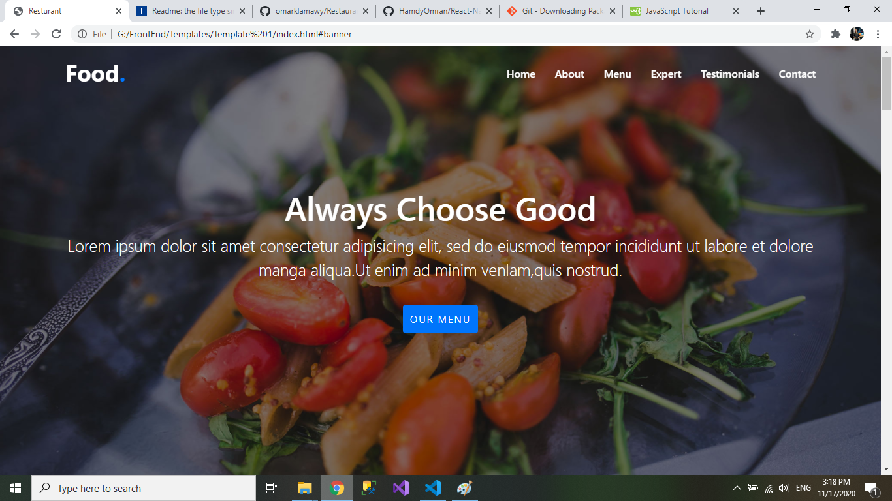
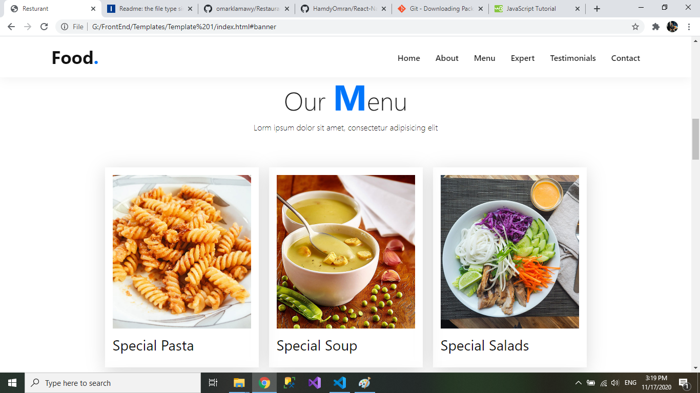
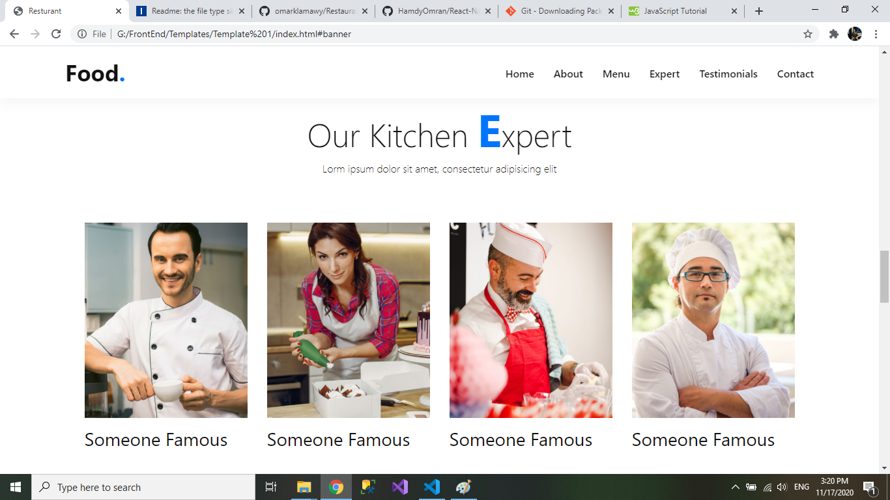

# Restaurant

A website used to introduce our restaurant and shows user our menu , chefs and reviews. Built with html, CSS and JavaScript.

---

## Main technologies used

- [HTML](https://www.w3schools.com/html/default.asp)
  > HTML is the standard markup language for Web pages.
- [CSS](https://www.w3schools.com/css/default.asp)
  > CSS is the language we use to style an HTML document and describes how HTML elements should be displayed.
- [Javascript](https://www.javascript.com/)
  > JavaScript is the world's most popular programming language and it is the programming language of the Web.

## Installation

---

A little intro about the installation.

```
$ git clone https://github.com/omarklamawy/Restaurant-website-template.git
$ cd ../path/to/the/file
open index.html in browser
```

## Reflection

This was a 3 day long project. Project goals included using technologies learned up until this point and familiarizing myself with documentation for new features.

Originally I wanted to build a website that allowed users to know about our restaurant. I started this process by using html and css simultaneously then adding javascript.

One of the main challenges I ran into was how to make this template responsive. This lead me to spend a lot of time on a research, At the end I reached the soultion using media query.

---

## Project Screen Shots





